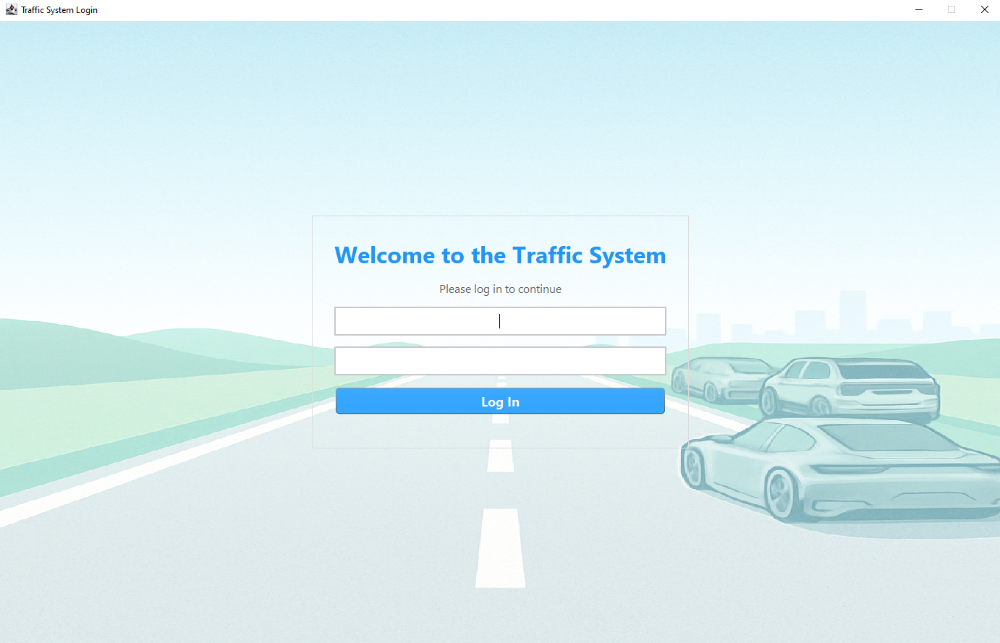
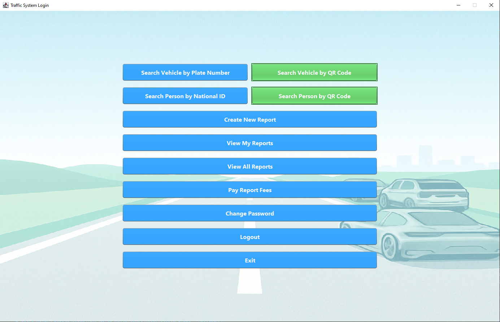
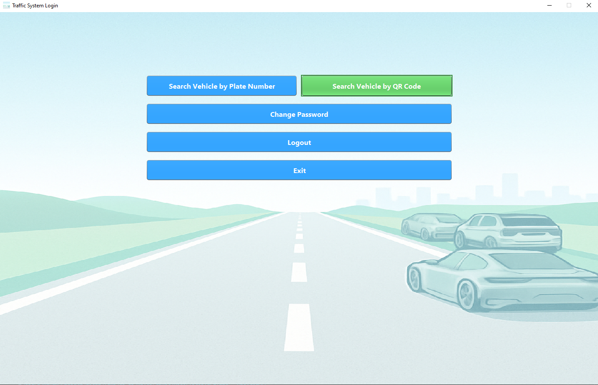
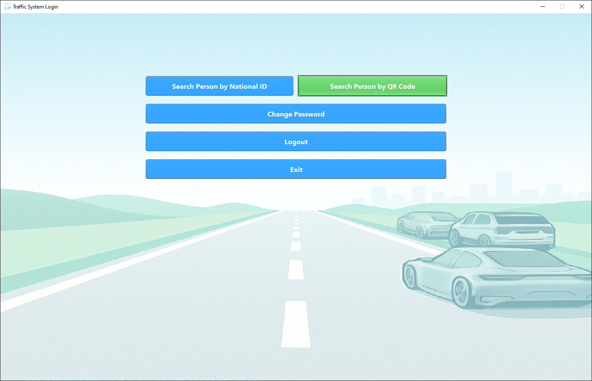
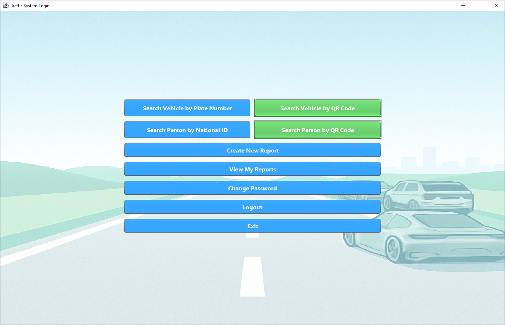

# Traffic System

A professional, modern Java Swing-based Traffic System for managing vehicles, persons, police, and traffic violation reports. The system supports both a graphical user interface (GUI) and a command-line interface (CLI) for police officers to log in, search, and manage traffic-related data.

---

## Sample Police Login Accounts

Below are sample login credentials for each police rank (preloaded in the database):

| Rank        | Username      | Password      | Description         |
|-------------|--------------|--------------|---------------------|
| Chief       | AhmedSaleh    | 12345678     | Admin (Rank 1)      |
| Captain     | Peter         | 12345678     | Rank 2              |
| Lieutenant  | Parker        | 12345678     | Rank 3              |
| Officer     | Tom           | 12345678     | Rank 4              |
| Officer     | Tony          | 12345678     | Rank 4              |
| Sergeant    | SophiaW       | password12   | Rank 3              |
| Officer     | MichaelJ      | password13   | Rank 4              |
| Sergeant    | emilyb        | securepass123| Rank 3              |
| Lieutenant  | tomh          | pass456      | Rank 2              |

> Use these accounts to log in and test the system with different permissions.

---

## Screenshots

Below are screenshots of the main features of the Traffic System application:

### Login Screen



### Rank1 Main Menu



### Rank2 Main Menu



### Rank3 Main Menu



### Rank4 Main Menu



---

## 🚀 Demo Video

A full walkthrough demo video is available on  OneDrive:  
**[Watch the Demo Video](https://alexnationaluniv-my.sharepoint.com/:f:/g/personal/2405043_anu_edu_eg/Em-DNJ4Z0s1Is8u1hoOd0aQBPbb4PXPm6FbBXLSfI9Q8hQ?e=NuquoE)**

---

## Features

- **Secure User Authentication:** Police officers log in with a username and password.
- **Role-Based Access Control:** Menu options and permissions depend on the officer's rank.
- **Vehicle Management:** Search vehicles by plate number or QR code.
- **Person Management:** Search persons by national ID or QR code.
- **Report Management:** Create, view, and pay for traffic violation reports.
- **Password Management:** Officers can change their password from the main menu.
- **Modern GUI:** Stylish, responsive Java Swing interface with background image support and consistent design.
- **CLI Support:** Console-based interface for basic operations.
- **QR Code Integration:** Scan QR codes using a webcam to quickly find vehicles or persons.
- **Database Integration:** All data is stored in a relational database with sample data provided.
- **Extensible & Maintainable:** Clean, modular codebase following OOP best practices.

---

## Project Structure

```
TrafficSystem/
├── src/
│   └── main/
│       ├── java/
│       │   ├── App/
│       │   │   ├── GUIAPP.java
│       │   │   ├── Main.java
│       │   │   └── QRCodeScanner.java
│       │   ├── com/AavengersTrafficControle/trafficsystem/model/
│       │   │   ├── Person.java
│       │   │   ├── Police.java
│       │   │   ├── Driver.java
│       │   │   ├── Vehicle.java
│       │   │   ├── Car.java
│       │   │   ├── Report.java
│       │   │   ├── Truck.java
│       │   │   ├── Motorcycle.java
│       │   │   ├── Bus.java
│       │   └── dao/
│       │       ├── PersonDAO.java
│       │       ├── PoliceDAO.java
│       │       ├── ReportsDAO.java
│       │       ├── VehicleDAO.java
│       │       ├── DatabaseConnection.java
│       │       ├── DriverDAO.java
│       │       ├── CarDAO.java
│       │       ├── TruckDAO.java
│       │       ├── MotorcycleDAO.java
│       │       ├── BusDAO.java
│       └── resources/
│           ├── background.png
│           └── DataBase.sql
```

---

## Getting Started

### Prerequisites

- Java 17 or higher (Java 22 supported)
- Maven (for dependency management and building)
- Webcam (for QR code scanning features)
- A supported SQL database (see `DataBase.sql`)

### Build & Run

1. **Clone the repository:**
   ```sh
   git clone https://github.com/yourusername/TrafficSystem.git
   cd TrafficSystem/TrafficSystem
   ```

2. **Build the project:**
   ```sh
   mvn clean package
   ```

3. **Run the GUI application:**
   ```sh
   java -cp target/classes App.GUIAPP
   ```

   Or run the CLI:
   ```sh
   java -cp target/classes App.Main
   ```

### Database

- The schema and initial data are in [`src/main/resources/DataBase.sql`](src/main/resources/DataBase.sql).
- Update your database connection settings in [`DatabaseConnection.java`](src/main/java/dao/DatabaseConnection.java) as needed.

---

## Usage

- **Login:** Enter your police username and password.
- **Main Menu:** Options depend on your rank (search, create reports, view reports, pay fees, change password, etc.).
- **QR Code:** Use the "Search by QR Code" buttons to scan and search using a webcam.
- **Create Report:** Fill in the form and confirm to create a new traffic violation report.
- **Change Password:** Use the "Change Password" button in the main menu to update your password securely.

---

## Technologies Used

- Java 17+ (Swing for GUI)
- JDBC (Database access)
- ZXing & Webcam Capture (QR code scanning)
- Maven (build tool)
- SQL (PostgreSQL/MySQL compatible schema)

---

## Authors

- Mohamed Soliman

---

## License

This project is open source and available under the MIT License.

---

## Object-Oriented Programming Concepts Used

This project demonstrates several core Java OOP concepts:

- **Encapsulation:**  
  Classes such as `Vehicle`, `Person`, and `Police` encapsulate their data fields as private and provide public getter/setter methods to control access and modification.

- **Inheritance:**  
  The class `Car` extends `Vehicle`, and `Driver` may extend `Person`, allowing for code reuse and logical hierarchy.

- **Polymorphism:**  
  Methods can accept parameters of a superclass type (e.g., `Vehicle`), allowing different subclasses (like `Car`) to be used interchangeably.

- **Abstraction:**  
  The use of DAO (Data Access Object) classes such as `VehicleDAO`, `PersonDAO`, and `PoliceDAO` abstracts the database operations from the business logic.

These OOP principles help keep the code modular, maintainable, and extensible.

---

## GUI Walkthrough

The Traffic System features a modern Java Swing-based graphical user interface (GUI) designed for ease of use by police officers. Here’s a step-by-step walkthrough of the main GUI flow:

### 1. Login Screen

- **Fields:**  
  - Username  
  - Password  
- **Action:**  
  Enter your credentials and click the **Login** button.  
  If authentication is successful, you are taken to the main menu. Otherwise, an error message is shown.

### 2. Main Menu

The options displayed depend on your rank (role-based access):

- **Common Buttons:**  
  - **Search Vehicle by Plate Number**  
  - **Search Vehicle by QR Code**  
  - **Search Person by National ID**  
  - **Search Person by QR Code**  
  - **Create New Report**  
  - **View My Reports**  
  - **View All Reports** (for higher ranks)  
  - **Pay Report Fees**  
  - **Change Password**  
  - **Logout**  
  - **Exit**

### 3. Searching

- **Search Vehicle by Plate Number:**  
  Prompts for a plate number and displays vehicle details if found.

- **Search Vehicle by QR Code:**  
  Activates the webcam. Hold a vehicle QR code up to the camera to search.

- **Search Person by National ID:**  
  Prompts for a national ID and displays person details if found.

- **Search Person by QR Code:**  
  Activates the webcam. Hold a person QR code up to the camera to search.

### 4. Reports

- **Create New Report:**  
  Opens a form to enter details about a new traffic violation. Submit to save the report.

- **View My Reports:**  
  Displays a list of reports you have created.

- **View All Reports:**  
  (Available to higher ranks) Shows all reports in the system.

- **Pay Report Fees:**  
  Allows payment of outstanding report fees.

### 5. Other Actions

- **Change Password:**  
  Allows you to securely update your password from within the application.

- **Logout:**  
  Logs you out and returns to the login screen.

- **Exit:**  
  Prompts for confirmation and closes the application.

---

**Note:**  
All buttons are styled for clarity and usability. QR code features require a connected webcam. Dialogs and forms use consistent fonts and colors for a professional look.

---

## Possible Extra Features

To make the Traffic System even more professional and useful, consider adding:

- **User Activity Logging:**  
  Track and log all user actions (searches, report creation, payments, etc.) for auditing and security.

- **Forgot Password / Password Reset:**  
  Allow officers to securely reset their password if forgotten (via email or admin approval).

- **Admin Dashboard:**  
  A dedicated dashboard for high-rank officers to view system statistics, recent activity, and manage users.

- **Notifications & Alerts:**  
  Notify officers of unpaid reports, expiring vehicle registrations, or urgent violations.

- **Advanced Search & Filtering:**  
  Allow filtering/searching by multiple fields (date range, status, location, etc.) for vehicles, persons, and reports.

- **Export to PDF/CSV:**  
  Export search results or reports to PDF or CSV for printing or sharing.

- **Mobile App Companion:**  
  A simple Android/iOS app for field officers to quickly scan QR codes and access data.

- **Multi-language Support:**  
  Add localization for different languages to make the app accessible to a wider audience.

- **Dark Mode:**  
  Provide a dark theme for the GUI for better usability in low-light environments.

- **Photo Attachments:**  
  Allow attaching photos (evidence, vehicle/person images) to reports.

- **Map Integration:**  
  Integrate with Google Maps/OpenStreetMap to show locations of incidents or vehicles.

- **Role Management:**  
  Allow admins to create/edit roles and permissions dynamically.

- **API Integration:**  
  Provide REST APIs for integration with other systems (e.g., government databases, insurance).

- **Unit & Integration Tests:**  
  Add automated tests to ensure code quality and reliability.

---
