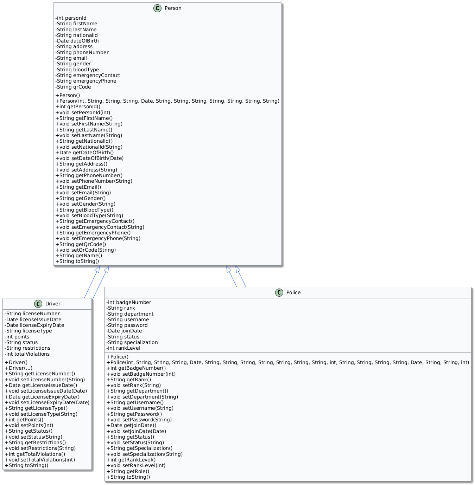

# Traffic System UML Class Diagrams

Below are the UML diagrams for the Traffic System project.  
For clarity and professionalism, the diagrams are provided as images.

---

## 1. Person, Driver, Police

---

## 2. Vehicle, Car, Bus, Motorcycle, Truck

---

## 3. Report & DAOs

## 4. All classes uml

---

